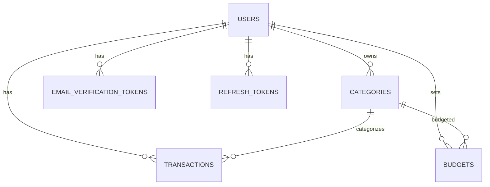

# Big Brother 💰

[](https://github.com/Abdalla312/The-Big-Brother-App/releases)
[](LICENSE)

A **personal expense tracking REST API** built with Spring Boot 3.5 and Java 21. Track your income and expenses, set
category budgets, and monitor your spending — all with JWT-authenticated, multi-user support.

> **Name origin**: A playful nod to "watching" your own money (not surveillance).

---

## Features

- **User authentication** — Register, login, and email verification flow with JWT (15-min access token + refresh token rotation)
- **Transaction management** — Log income/expenses with amounts, dates, notes, payment methods, and categories
- **Category system** — System-default categories (Food, Transportation, Salary, etc.) plus user-custom categories with
  colors/icons
- **Budget tracking** — Set monthly spending limits per category; API computes spent, remaining, and percent used
- **Filtering & pagination** — Query transactions by month, category, and type with paginated responses
- **Ownership validation** — Every resource is scoped to the authenticated user; no cross-user data access
- **OpenAPI 3.1 spec** — Bundled OpenAPI documentation at `backend/api-docs.json`
- **Containerized** — Multi-stage Docker build for production
- **Rate limiting** — Token-bucket algorithm protecting endpoints (configurable capacity, refill rate)
- **Refresh tokens** — Secure token rotation with versioned refresh tokens
- **Reports & analytics** — Category breakdowns, payment-method breakdowns, monthly trends, and summaries
- **Database migrations** — Flyway manages schema versioning (9 migrations)
- **Comprehensive testing** — Unit + integration tests with H2 in-memory DB
- **Frontend** — Dev-only HTML/JS testing client and a **React Native (Expo) mobile app** in progress as the primary client

---

## Tech Stack

| Layer          | Technology                                 |
|----------------|--------------------------------------------|
| **Language**   | Java 21                                    |
| **Framework**  | Spring Boot 3.5.14                         |
| **Build**      | Maven (wrapper included)                   |
| **Database**   | PostgreSQL (Flyway migrations)             |
| **ORM**        | Spring Data JPA + Hibernate                |
| **Security**   | Spring Security, JWT (jjwt 0.12.7), BCrypt |
| **Mappings**   | MapStruct 1.6.3                            |
| **Validation** | Jakarta Bean Validation                    |
| **Mail**       | Spring Mail (SMTP)                         |
| **Docs**       | SpringDoc OpenAPI 2.8.5                    |
| **Monitoring** | Spring Boot Actuator                       |
| **Tests**      | JUnit 5, H2, Spring Boot Test              |
| **Infra**      | Docker, Railway                            |

---

## Architecture Decisions

| Decision | Why |
|---|---|
| Feature-based packages (`auth/`, `transaction/`, etc.) | Each feature is self-contained. When you open a package, you see everything about that feature in one place. Scales better than layer-based separation for large codebases. |
| UUID primary keys | Sequential IDs leak information (user count, creation order). UUIDs are safer and portfolio-impressive. |
| `BigDecimal` for money | Floating-point math causes rounding errors. `BigDecimal` is exact — this is a real interview question. |
| Flyway migrations over `ddl-auto` | Versioned, repeatable migrations. Every production app uses migration tools. `ddl-auto` caused issues in prior projects. |
| DTOs separate from entities | Different validation rules, different fields exposed. Prevents data leaks. Entities represent DB state; DTOs represent user input. |
| Stateless JWT auth | Mobile apps don't use cookies. JWT in headers is the standard pattern for mobile backends. |
| MapStruct for DTO mapping | Compile-time-safe mapping. No runtime reflection overhead. |
| Jakarta Bean Validation on DTOs | Validation rules live close to the input layer. Keeps entities clean and focused on persistence. |
| `@Transactional(readOnly = true)` on read methods | Reduces transaction overhead on queries. Hibernate optimizes read-only sessions. |
| H2 in PostgreSQL mode for tests | Fast, no external dependencies needed. Tests run without a real PostgreSQL instance. |
| Consistent `ApiResponse` wrapper | Frontend has one error-handling pattern for all endpoints. No guessing the response shape. |
| Pagination on all list endpoints | A user with thousands of transactions can't load all at once on mobile. Standard page sizes (20–50). |
| Token-bucket rate limiting (custom) | No external dependency. Protects auth endpoints from brute-force. Configurable capacity and refill rate. |
| Refresh token rotation | Each refresh revokes the old token. Prevents replay attacks. Bulk revocation on password change or account deletion. |
| Multi-stage Docker build | Final image is ~200MB not ~800MB. No build tools in production. |

---

### Prerequisites

- JDK 21
- PostgreSQL instance (or Docker)
- Maven (or use the included `mvnw` wrapper)

### Database Setup

Open a terminal and run:

```bash
psql -U postgres
```

Then inside the `psql` shell:

```sql
CREATE DATABASE big_brother;
CREATE USER big_bro WITH PASSWORD 'big_bro';
ALTER ROLE big_bro SET client_encoding TO 'utf8';
ALTER ROLE big_bro SET default_transaction_isolation TO 'read committed';
ALTER ROLE big_bro SET timezone TO 'Africa/Cairo';
GRANT ALL PRIVILEGES ON DATABASE big_bro TO big_bro;
\q
```

---

After setting up the database, create a `.env` file in `backend/` with your credentials (see below).

### 1. Clone & Configure

```bash
git clone <repo-url>
cd Big_Brother/backend
```

Copy `.env.example` (create one based on the variables below) and fill in your values:

```env
SPRING_PROFILES_ACTIVE=dev
DB_URL=jdbc:postgresql://localhost:5432/big_brother
DB_SCHEMA=public
DB_USERNAME=big_bro
DB_PASSWORD=your_password
JWT_SECRET=base64-encoded-256-bit-key
JWT_ACCESS_TOKEN_EXPIRY_MS=900000
MAIL_HOST=smtp.gmail.com
MAIL_PORT=587
MAIL_USERNAME=your_email@domain.com
MAIL_PASSWORD=your_app_password
APP_BACKEND_URL=http://localhost:8080
```

### 2. Run

```bash
# Development (reads .env automatically)
./mvnw spring-boot:run -Dspring-boot.run.profiles=dev

# Production
./mvnw spring-boot:run -Dspring-boot.run.profiles=prod
```

The API starts at `http://localhost:8080`.

### 3. Run Tests

```bash
./mvnw test
```

### Docker

```bash
cd backend
docker build -t big-brother:latest .
docker run -p 8080:8080 --env-file .env big-brother:latest
```

---

## API Reference

All endpoints are prefixed with `/api/v1`. Most require a `Authorization: Bearer <token>` header.

### Health

| Method | Path             | Auth | Description  |
|--------|------------------|------|--------------|
| GET    | `/api/v1/health` | No   | Health check |

### Authentication

| Method | Path                                       | Auth | Description                                                 |
|--------|--------------------------------------------|------|-------------------------------------------------------------|
| POST   | `/api/v1/auth/register`                    | No   | Register (name, email, password) — sends verification email |
| POST   | `/api/v1/auth/login`                       | No   | Login — returns access + refresh tokens                     |
| POST   | `/api/v1/auth/refresh`                     | No   | Refresh access token using refresh token                    |
| POST   | `/api/v1/auth/logout`                      | No   | Revoke refresh token (logout)                               |
| GET    | `/api/v1/auth/verify-email?userId=&token=` | No   | Verify email from link                                      |
| POST   | `/api/v1/auth/resend-verification`         | No   | Resend verification (5-min cooldown)                        |

### Categories

| Method | Path                      | Auth | Description                                |
|--------|---------------------------|------|--------------------------------------------|
| GET    | `/api/v1/categories`      | Yes  | List categories (paginated); `type`: `all\|user\|default` |
| POST   | `/api/v1/categories`      | Yes  | Create custom category                     |
| PATCH  | `/api/v1/categories/{id}` | Yes  | Update custom category                     |
| DELETE | `/api/v1/categories/{id}` | Yes  | Delete custom category (fails 409 if used) |

### Transactions

| Method | Path                        | Auth | Description                                          |
|--------|-----------------------------|------|------------------------------------------------------|
| GET    | `/api/v1/transactions`      | Yes  | List with filters (month, categoryId, type, page, size) |
| GET    | `/api/v1/transactions/{id}` | Yes  | Get single transaction                                  |
| POST   | `/api/v1/transactions`      | Yes  | Create transaction                                      |
| PATCH  | `/api/v1/transactions/{id}` | Yes  | Update transaction                                      |
| DELETE | `/api/v1/transactions/{id}` | Yes  | Delete transaction                                      |

### Budgets

| Method | Path                           | Auth | Description                               |
|--------|--------------------------------|------|-------------------------------------------|
| GET    | `/api/v1/budget?month=yyyy-MM` | Yes  | List budgets with pagination and spent/remaining/percent |
| POST   | `/api/v1/budget`               | Yes  | Create budget                             |
| PATCH  | `/api/v1/budget/{id}`          | Yes  | Update budget                             |
| DELETE | `/api/v1/budget/{id}`          | Yes  | Delete budget                             |

### Users

| Method | Path                     | Auth | Description          |
|--------|--------------------------|------|----------------------|
| GET    | `/api/v1/users/me`       | Yes  | Get user profile     |
| PATCH  | `/api/v1/users/me`       | Yes  | Update user profile  |
| PATCH  | `/api/v1/users/me/password` | Yes | Change password     |
| DELETE | `/api/v1/users/me`       | Yes  | Delete account       |

### Reports

| Method | Path                                        | Auth | Description                          |
|--------|---------------------------------------------|------|--------------------------------------|
| GET    | `/api/v1/reports/summary`                   | Yes  | Monthly income/expense summary       |
| GET    | `/api/v1/reports/category-breakdown`        | Yes  | Category spending breakdown          |
| GET    | `/api/v1/reports/trend`                     | Yes  | Monthly spending trends              |
| GET    | `/api/v1/reports/budget-comparison`         | Yes  | Budget vs actual comparison          |
| GET    | `/api/v1/reports/payment-method-breakdown`  | Yes  | Payment method breakdown             |

### Response Format

**Success:**

```json
{
  "status": 200,
  "message": "Success",
  "data": {
    ...
  },
  "timestamp": "2026-07-09T12:00:00Z"
}
```

**Error:**

```json
{
  "status": 400,
  "error": "Bad Request",
  "message": "Validation failed",
  "timestamp": "2026-07-09T12:00:00Z",
  "path": "/api/v1/transactions",
  "errors": [
    "amount: must be greater than 0"
  ]
}
```

**Paginated:**

```json
{
  "content": [],
  "page": 0,
  "size": 20,
  "totalPages": 1,
  "totalElements": 0,
  "first": true,
  "last": true,
  "empty": true,
  "numberOfElements": 0,
  "sort": []
}
```

---

## Project Structure

```
Big_Brother/
├── backend/
│   ├── src/
│   │   ├── main/
│   │   │   ├── java/com/expensetracker/big_brother/
│   │   │   │   ├── auth/           # Registration, login, JWT
│   │   │   │   ├── budget/         # Budget CRUD + spending calc
│   │   │   │   ├── category/       # System + custom categories
│   │   │   │   ├── common/         # ApiResponse, BaseEntity, etc.
│   │   │   │   ├── config/         # Rate limiting, app config
│   │   │   │   ├── exception/      # Global exception handler
│   │   │   │   ├── mail/           # Email sending service
│   │   │   │   ├── refreshtoken/   # Refresh-token persistence
│   │   │   │   ├── report/         # Reports & analytics
│   │   │   │   ├── security/       # JWT filter, security config
│   │   │   │   ├── transaction/    # Transaction CRUD + specs
│   │   │   │   ├── user/           # User profile management
│   │   │   │   └── verification/   # Email verification tokens
│   │   │   └── resources/
│   │   │       ├── application.yml
│   │   │       ├── application-dev.yml
│   │   │       ├── application-prod.yml
│   │   │       └── db/migration/   # Flyway migrations (V1-V9)
│   │   └── test/
│   ├── Dockerfile
│   ├── pom.xml
│   ├── mvnw / mvnw.cmd
│   ├── api-docs.json               # Full OpenAPI 3.1 spec
│   └── railway.json
├── frontend/                        # Dev-only HTML/JS testing client
├── docker-compose.yml              # PostgreSQL + Mailhog for local dev
└── .gitignore
```

---

## Database Schema

9 Flyway migrations create these tables:

| Table                      | Key columns                                                     | Notes                             |
|----------------------------|-----------------------------------------------------------------|-----------------------------------|
| `users`                    | id (UUID), email, password_hash, role, user_verified, pending_email, token_version | Unique email (V8, V9) |
| `categories`               | id (UUID), name, type, color, icon, user_id                     | Null user_id = system default     |
| `transactions`             | id (UUID), type, amount, transaction_date, user_id, category_id |                                   |
| `budgets`                  | id (UUID), month (YYYY-MM), limit_amount, user_id, category_id  | Unique on (user, category, month) |
| `email_verification_token` | token_hash (SHA-256), user_id, expires_at                       | One token per user                |
| `refresh_tokens`           | token_hash, user_id, expires_at, token_version                  | Versioned refresh tokens (V9)     |

Additional migrations: V8 adds `pending_email` column to users, V9 adds token versioning and refresh tokens table.

**Default categories** (seed migration V6): Food & Dining, Transportation, Housing, Utilities (expenses) + Salary,
Investments (income).

### Entity Relationship Diagram



### System Architecture Diagram

```mermaid
graph TB
    subgraph Client["Client"]
        M[React Native / Expo App<br/>(Primary Client)]
        D[HTML/JS Dev Client<br/>(Development Only)]
    end

    subgraph "AWS Cloud (Planned)"
        LB[Load Balancer / ALB]
        API[Spring Boot API<br/>ECS Fargate]
        DB[(PostgreSQL 17<br/>RDS)]
        CACHE[(ElastiCache Redis)]
        SES[AWS SES / Mailgun<br/>(Transactional Email)]
    end

    M -->|HTTPS| LB
    D -->|HTTPS| LB
    LB --> API
    API --> DB
    API --> CACHE
    API --> SES
```

---

## Configuration

### Profiles

| Profile         | File                   | Behavior                                          |
|-----------------|------------------------|---------------------------------------------------|
| `dev` (default) | `application-dev.yml`  | Reads `.env`, verbose SQL logging, DEBUG level    |
| `prod`          | `application-prod.yml` | Graceful shutdown, INFO level, Actuator endpoints |

### Key Environment Variables

| Variable                     | Default       | Description                       |
|------------------------------|---------------|-----------------------------------|
| `SPRING_PROFILES_ACTIVE`     | `dev`         | Active profile                    |
| `DB_URL`                     | —             | PostgreSQL JDBC URL               |
| `DB_SCHEMA`                  | `public`      | Database schema                   |
| `DB_USERNAME`                | —             | Database user                     |
| `DB_PASSWORD`                | —             | Database password                 |
| `JWT_SECRET`                 | —             | Base64-encoded HMAC-SHA key       |
| `JWT_ACCESS_TOKEN_EXPIRY_MS` | `900000`      | Access token expiry in ms (15 min)|
| `JWT_REFRESH_TOKEN_EXPIRY_DAYS` | `30`      | Refresh token expiry in days      |
| `DB_POOL_SIZE`               | `10`          | HikariCP maximum pool size        |
| `MAIL_HOST`                  | —             | SMTP host                         |
| `MAIL_PORT`                  | —             | SMTP port                         |
| `MAIL_USERNAME`              | —             | SMTP username                     |
| `MAIL_PASSWORD`              | —             | SMTP password/app password        |
| `APP_BACKEND_URL`            | —             | Public URL for verification links |

### Database Configuration

| Setting | Value | Description |
|---------|-------|-------------|
| `spring.jpa.hibernate.ddl-auto` | `validate` | Schema managed by Flyway — Hibernate only validates |
| `spring.jpa.open-in-view` | `false` | Prevents lazy loading in views |
| `spring.flyway.enabled` | `true` | Flyway migration enabled |
| `spring.flyway.baseline-on-migrate` | `true` | Baselines existing databases |
| `spring.flyway.validate-on-migrate` | `true` | Validates migrations on startup |
| `spring.datasource.hikari.maximum-pool-size` | `10` (configurable via `DB_POOL_SIZE`) | Connection pool max |
| `spring.datasource.hikari.minimum-idle` | `2` | Minimum idle connections |

**Test profile** (`src/test/resources/application.yml`) uses H2 in PostgreSQL compatibility mode, so tests run without a real PostgreSQL instance.

```yaml
# Test datasource (H2)
spring:
  datasource:
    url: jdbc:h2:mem:testdb;MODE=PostgreSQL;DATABASE_TO_LOWER=TRUE;CASE_INSENSITIVE_IDENTIFIERS=TRUE
    driver-class-name: org.h2.Driver
  flyway:
    enabled: true
    locations: classpath:db/migration
```

---

## Testing

Tests use H2 in PostgreSQL compatibility mode. 14 test classes covering all service layers and endpoints:

```bash
./mvnw test
```

- **Unit tests**: `AuthServiceTest`, `BudgetServiceTest`, `CategoryServiceTest`, `TransactionServiceTest`, `UserServiceTest`, `RefreshTokenServiceTest`, `TokenBucketTest`
- **Integration tests**: `AuthIntegrationTest`, `BudgetIntegrationTest`, `CategoryIntegrationTest`, `TransactionIntegrationTest`, `UserIntegrationTest`
- **Base class**: `BaseIntegrationTest` — Shared setup for all integration tests

---

## Deployment

Two deployment targets are configured:

| Target    | Config                           | Status    |
|-----------|----------------------------------|-----------|
| **Railway** (current) | `backend/railway.json` | Deployed |
| **AWS ECS Fargate** (planned) | `backend/plans/aws_deployment_guide.md` | In progress |

### AWS ECS Fargate (Planned)

The backend will run as a containerized service on AWS ECS Fargate. Key architectural decisions:

1. **ECS Fargate** over EC2 — no server management, pay-per-use, built-in scaling
2. **RDS PostgreSQL** for managed database
3. **AWS Secrets Manager** for environment variables (DB credentials, JWT secret)
4. **Application Load Balancer** for HTTPS termination and traffic routing
5. **CloudWatch** for logging and monitoring
6. **Route 53** for DNS + **ACM** for SSL certificates

All configuration comes from environment variables — no hardcoded secrets.

---

## Screenshots & Demo

> Screenshots and a demo GIF/video will be added here once the mobile app and dashboard are complete.

---

## OpenAPI Spec

A bundled OpenAPI 3.1 specification is available at `backend/api-docs.json`. You can import it into Postman, Insomnia,
or Swagger UI for interactive exploration.

---

## Known Issues & Roadmap

**Completed:**
- Pagination for categories and budgets
- Rate limiting on auth endpoints
- JWT refresh token rotation + revocation
- `docker-compose.yml` with PostgreSQL + Mailhog
- `.env.example` template
- Architecture documentation (diagrams + ADRs)
- Apache 2.0 license

**Planned features:**
- Recurring transactions
- React Native mobile app (Expo Router)
- Enhanced dashboard analytics
- CSV export
- AWS ECS Fargate deployment

See [CHANGELOG.md](CHANGELOG.md) for version history and [GitHub Releases](https://github.com/Abdalla-99/Big_Brother/releases) for downloadable artifacts.

---

## License

Licensed under the [Apache License 2.0](LICENSE).
