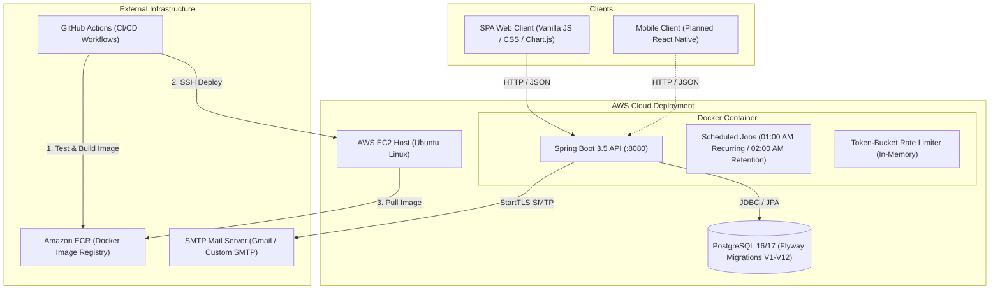
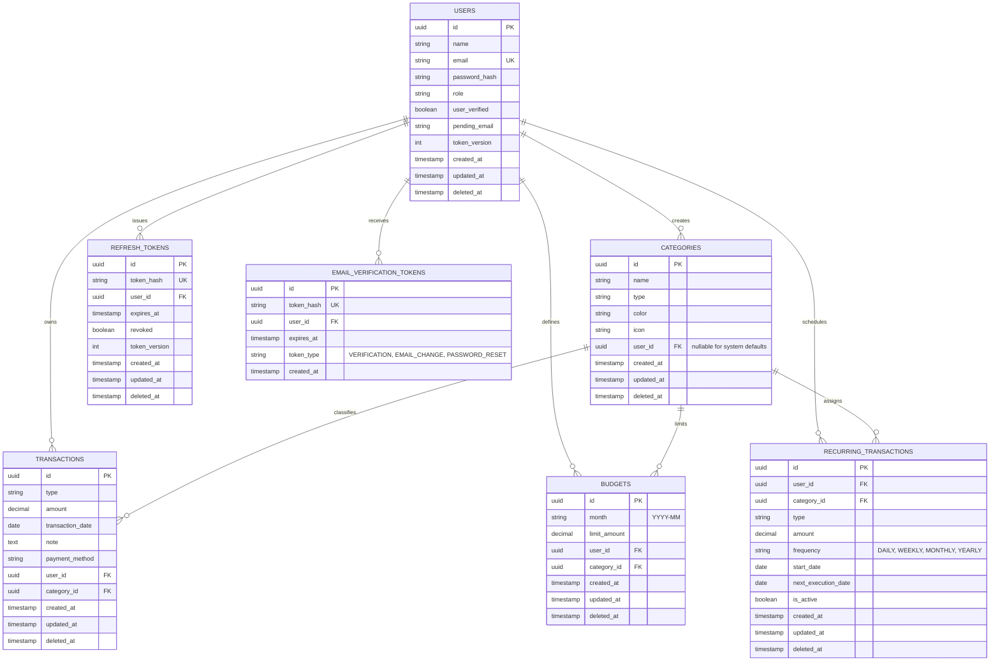

# Big Brother 💰

[](https://github.com/Abdalla312/The-Big-Brother-App/actions/workflows/ci.yml)
[](https://github.com/Abdalla312/The-Big-Brother-App/releases)
[](LICENSE)
[](https://www.oracle.com/java/)
[](https://spring.io/projects/spring-boot)
[](https://www.postgresql.org/)

**Big Brother** is an enterprise-grade personal expense tracking and financial management platform. It features a robust **Spring Boot 3.5 REST API** backend paired with a responsive, modern **Single Page Application (SPA)** frontend with light/dark theming and data visualizations.

> **Name Origin**: A playful nod to "watching" your own money and financial habits (not surveillance).

---

## Table of Contents

- [Features](#features)
- [System Architecture](#system-architecture)
- [Entity-Relationship Diagram](#entity-relationship-diagram)
- [Tech Stack](#tech-stack)
- [Architecture Decisions](#architecture-decisions)
- [Project Structure](#project-structure)
- [Database Schema & Migrations](#database-schema--migrations)
- [Configuration & Environment Variables](#configuration--environment-variables)
- [Getting Started](#getting-started)
  - [Prerequisites](#prerequisites)
  - [Option A: Quick Start with Docker Compose](#option-a-quick-start-with-docker-compose)
  - [Option B: Manual Local Development](#option-b-manual-local-development)
- [API Reference](#api-reference)
  - [Health & Monitoring](#health--monitoring)
  - [Authentication & Password Reset](#authentication--password-reset)
  - [Categories](#categories)
  - [Transactions](#transactions)
  - [Recurring Transactions](#recurring-transactions)
  - [Budgets](#budgets)
  - [User Profile](#user-profile)
  - [Reports & Analytics](#reports--analytics)
  - [Response Envelopes](#response-envelopes)
- [Testing & Quality Assurance](#testing--quality-assurance)
  - [Unit & Integration Tests](#unit--integration-tests)
  - [Code Coverage (JaCoCo)](#code-coverage-jacoco)
  - [Performance & Load Testing (k6)](#performance--load-testing-k6)
- [CI/CD & Cloud Deployment](#cicd--cloud-deployment)
- [Frontend Client](#frontend-client)
- [Roadmap](#roadmap)
- [License](#license)

---

## Features

### 🔐 Authentication & Security
- **Stateless JWT Flow** — Short-lived access tokens (15-minute default) combined with secure, versioned refresh token rotation.
- **In-Memory Rate Limiting** — Custom token-bucket rate limiter (`RateLimitingFilter`) applied to `/api/v1/auth/**` routes with IP extraction (supporting `X-Forwarded-For`), dynamic `Retry-After` headers, HTTP 429 status, and periodic memory cleanup.
- **Email Verification & Password Recovery** — Asynchronous HTML email dispatch via Thymeleaf and JavaMail for initial verification, email change requests, and password reset flows with token expiration.
- **Strict Data Ownership** — Complete isolation between tenant accounts; users can only view, edit, soft-delete, or restore their own records.
- **Security Best Practices** — BCrypt password hashing, Jakarta Bean Validation (`@ValidPassword`, `@Pattern`), and configurable CORS policy via `CORS_ALLOWED_ORIGINS`.

### 💵 Transaction & Budget Management
- **Transaction Tracking** — Record income and expenses using high-precision `BigDecimal` arithmetic, customizable payment methods, dates, notes, and category associations.
- **Filtering & Pagination** — Multi-parameter querying by month (`YYYY-MM`), category, and transaction type (`INCOME | EXPENSE`) with Spring Data Pageable metadata.
- **CSV Data Export** — Streaming CSV export endpoint (`/api/v1/transactions/export`) supporting date ranges (`from`, `to`), transaction type, and category filters.
- **Category System** — Pre-seeded default categories (Food, Transportation, Housing, Salary, etc.) plus user-created custom categories with color palettes, Lucide icons, and pre-built category templates.
- **Category Budgets** — Monthly spending limits per category with live calculations for total spent, remaining allowance, and percentage used.

### 🔁 Recurring Transactions Engine
- **Automated Processing** — Scheduled daily background job (`RecurringTransactionScheduler` at 01:00 AM) that discovers due rules, creates actual transaction entries, and advances execution dates.
- **Flexible Frequencies** — Full support for `DAILY`, `WEEKLY`, `MONTHLY`, and `YEARLY` schedules.
- **Active Controls** — Instantly pause or resume recurring transaction schedules via dedicated toggle endpoints.

### 🗑️ Soft-Delete & Data Retention (Trash System)
- **Soft-Delete Across Entities** — Soft deletion applied to Transactions, Categories, Budgets, Recurring Transactions, and Users via Hibernate `@SQLDelete` and `@Filter(name = "deletedFilter")`.
- **Trash & Restore API** — Dedicated `GET /trash` and `PUT /{id}/restore` endpoints for recovering deleted categories, transactions, budgets, and recurring rules.
- **30-Day Automated Purge** — Scheduled daily cleanup job (`DataRetentionJob` at 02:00 AM) permanently removes records whose `deleted_at` timestamp is older than 30 days.

### 📊 Reports & Financial Analytics
- **Monthly Summary** — Aggregated monthly income, total expenses, and net savings.
- **Category Breakdown** — Percentage and value distribution of spending by category.
- **Monthly Trends** — Historical spending and income trajectories over customizable date ranges.
- **Budget Comparison** — Category-level comparison between set budget limits and actual expenditure.
- **Payment Method Breakdown** — Spending distribution grouped by payment methods (Cash, Credit Card, Bank Transfer, etc.).

### 💻 Modern Web Client
- **Responsive SPA** — Vanilla ES Modules architecture with custom client-side hash routing and authentication guards.
- **Light & Dark Mode** — CSS-variable-driven theme engine with OS preference detection (`prefers-color-scheme`) and persistent toggle.
- **Interactive Visualizations** — Integrated Chart.js charts for category spending doughnuts, monthly trend bars, and budget progress.
- **Built-in Node Server** — Zero-dependency local development server (`server.js`) with dynamic runtime `BACKEND_URL` injection and SPA routing fallback.
- **Production Ready** — Pre-configured for static hosting or Vercel deployments (`vercel.json`, `build.js`).

---

## System Architecture



---

## Entity-Relationship Diagram



---

## Tech Stack

| Layer | Technology | Purpose |
|---|---|---|
| **Language** | Java 21 (LTS) | Modern Java language features (records, pattern matching, virtual threads ready) |
| **Framework** | Spring Boot 3.5.14 | Core application framework, dependency injection, and REST controllers |
| **Security** | Spring Security 6 & JJWT 0.12.7 | Stateless JWT filter chain, BCrypt hashing, and role/ownership security |
| **Database & ORM** | PostgreSQL 16+, Spring Data JPA, Hibernate 6 | Relational persistence, connection pooling (HikariCP), soft-delete filters |
| **Migrations** | Flyway 10+ | Repeatable, version-controlled relational database schema migrations (V1–V12) |
| **Object Mapping** | MapStruct 1.6.3 | Compile-time type-safe DTO-to-entity mapping without reflection overhead |
| **Templating** | Thymeleaf 3 | Rich responsive HTML email templates for verification and password reset |
| **Validation** | Jakarta Bean Validation | Declarative input validation at the API controller boundary |
| **Documentation** | SpringDoc OpenAPI 2.8.14 | Automated OpenAPI 3.1 specification generation and Swagger UI |
| **Monitoring** | Spring Boot Actuator | Production health checks, application info, and metric endpoints |
| **Frontend** | Vanilla JavaScript (ESM) + Modern CSS | Lightweight SPA, Chart.js 4.4, Lucide Icons, theme manager |
| **Frontend Server** | Node.js HTTP Server (`server.js`) | Local static server with runtime `BACKEND_URL` injection & SPA routing |
| **Testing** | JUnit 5, Mockito, Testcontainers PostgreSQL 2.0.5 | Isolated unit tests and real-database containerized integration tests |
| **Performance** | k6 | Load and stress performance test suite with latency thresholds |
| **Code Coverage** | JaCoCo 0.8.12 | Automated test code coverage analysis during Maven build verification |
| **DevOps & Cloud** | Docker, Docker Compose, GitHub Actions, AWS EC2, Amazon ECR | Multi-stage Docker packaging, CI/CD automated pipeline, and EC2 cloud deployment |

---

## Architecture Decisions

| Decision | Motivation & Rationale |
|---|---|
| **Feature-Packaged Architecture** | Code is organized by domain module (`auth`, `transaction`, `budget`, `category`, `recurring`, `report`, `user`) rather than layers. Keeps DTOs, controllers, services, repositories, and entities co-located. |
| **UUID Primary Keys** | Prevents sequential ID enumeration attacks, avoids exposing database insertion counts, and enables distributed ID generation. |
| **`BigDecimal` for Currency** | Prevents IEEE 754 floating-point rounding errors when calculating transaction totals, budget percentages, and report sums. |
| **Flyway Migrations (`ddl-auto: validate`)** | Strict production-grade migration management. Hibernate is restricted to validating schema structures against compiled entities. |
| **Stateless JWT with Token Rotation** | Decouples authentication from session state for easy horizontal scalability. Refresh token rotation invalidates old tokens upon usage, mitigating token theft risks. |
| **In-Memory Token-Bucket Limiter** | Lightweight rate-limiting filter built without external cache dependencies, safeguarding authentication endpoints from credential-stuffing and brute-force attacks. |
| **Soft Deletion with Trash Recovery** | Accidental deletions of transactions, categories, budgets, or recurring rules can be restored via the UI within 30 days prior to permanent cron purging. |
| **Multi-Stage Docker Image** | Separates Maven compilation from runtime JRE execution, shrinking final image size down to ~200MB on an Alpine base. |

---

## Project Structure

```
Big_Brother/
├── .github/
│   └── workflows/
│       ├── ci.yml                     # GitHub Actions CI (Maven verify + Testcontainers)
│       └── deploy.yml                 # GitHub Actions CD (Docker build, ECR push, EC2 deploy)
├── backend/
│   ├── src/
│   │   ├── main/
│   │   │   ├── java/com/expensetracker/big_brother/
│   │   │   │   ├── auth/              # Registration, login, password recovery, JWT DTOs
│   │   │   │   ├── budget/            # Monthly budget tracking & spending calculation
│   │   │   │   ├── category/          # System defaults & user-defined categories
│   │   │   │   ├── common/            # ApiResponse, PageResponse, BaseEntity, soft-delete
│   │   │   │   ├── config/            # SecurityConfig, RateLimitingFilter, TokenBucket
│   │   │   │   ├── exception/         # GlobalExceptionHandler & API error models
│   │   │   │   ├── mail/              # Email sending service & Thymeleaf template engine
│   │   │   │   ├── recurring/         # Recurring rules, scheduler cron, execution processor
│   │   │   │   ├── refreshtoken/      # Hashed refresh-token persistence and rotation
│   │   │   │   ├── report/            # Aggregations, summaries, trends, breakdowns
│   │   │   │   ├── scheduled/         # DataRetentionJob (30-day soft-delete purge cron)
│   │   │   │   ├── security/          # JwtAuthenticationFilter, UserDetails, EntryPoint
│   │   │   │   ├── transaction/       # Transaction CRUD, specifications, CSV export
│   │   │   │   ├── user/              # User profile, password update, account deletion
│   │   │   │   ├── verification/      # Email verification token lifecycle
│   │   │   │   └── BigBrotherApplication.java
│   │   │   └── resources/
│   │   │       ├── application.yml    # Base configuration properties
│   │   │       ├── application-dev.yml# Development profile overrides
│   │   │       ├── application-prod.yml# Production profile (graceful shutdown, INFO log)
│   │   │       ├── templates/email/   # Thymeleaf HTML email templates
│   │   │       └── db/migration/      # Flyway SQL migrations (V1 to V12)
│   │   └── test/
│   │       ├── java/                  # 29+ Unit & Integration test classes
│   │       └── load/
│   │           └── load-test.js       # k6 performance & load testing suite
│   ├── docker-compose.yml             # Local Docker Compose setup (PostgreSQL + App)
│   ├── Dockerfile                     # Multi-stage production build
│   ├── pom.xml                        # Maven dependencies & plugins
│   ├── mvnw / mvnw.cmd                # Maven wrapper binaries
│   └── api-docs.json                  # Bundled OpenAPI 3.1 specification
├── frontend/
│   ├── css/
│   │   └── app.css                    # Tailwind-compatible styles & CSS theme variables
│   ├── js/
│   │   ├── components/                # Sidebar, modals, table, toast, trash-modal
│   │   ├── pages/                     # Dashboard, transactions, budgets, recurring, reports, auth
│   │   ├── api.js                     # Fetch client with auto-refresh and token handling
│   │   ├── app.js                     # Application entry point & route definitions
│   │   ├── auth.js                    # Local auth state & session storage
│   │   ├── config.js                  # Runtime API_URL placeholder configuration
│   │   ├── router.js                  # Client-side hash router with auth guards
│   │   ├── theme.js                   # Dark/light mode theme toggle manager
│   │   └── utils.js                   # Currency, date, and status formatters
│   ├── vendor/                        # Offline Chart.js & Lucide icon bundles
│   ├── build.js                       # Build script substituting BACKEND_URL for production
│   ├── server.js                      # Built-in Node.js development server
│   ├── vercel.json                    # Static deployment configuration for Vercel
│   ├── index.html                     # SPA shell
│   └── package.json                   # Frontend npm scripts (`npm start`, `npm run dev`)
├── .env.example                       # Reference environment configuration
├── CHANGELOG.md                       # Semantic versioning release log
├── LICENSE                            # Apache License 2.0
└── README.md
```

---

## Database Schema & Migrations

The database schema is managed via **12 Flyway SQL migrations** located in `backend/src/main/resources/db/migration/`:

| Version | Migration Script | Description |
|---|---|---|
| **V1** | `V1__init.sql` | Baseline initialization migration. |
| **V2** | `V2__create_users_table.sql` | Creates `users` table with UUID PK, credentials, roles, and timestamps. |
| **V3** | `V3__create_categories_table.sql` | Creates `categories` table supporting system-defaults (`user_id IS NULL`) and custom categories. |
| **V4** | `V4__create_transactions_table.sql` | Creates `transactions` table with foreign keys to users and categories, `BigDecimal` amount, and payment method. |
| **V5** | `V5__create_budgets_table.sql` | Creates `budgets` table with unique constraint on `(user_id, category_id, month)`. |
| **V6** | `V6__seed_default_categories.sql` | Seeds system default categories: Food & Dining, Transportation, Housing, Utilities, Salary, and Investments. |
| **V7** | `V7__create_email_verification_tokens_table.sql` | Creates `email_verification_token` table with expiration timestamps and token hashes. |
| **V8** | `V8__add_pending_email.sql` | Adds `pending_email` to `users` to support verified email address changes. |
| **V9** | `V9__add_token_version_and_refresh_tokens.sql` | Introduces `token_version` on `users` and creates `refresh_token` table for token rotation. |
| **V10** | `V10__add_token_type_and_update_constraints.sql` | Extends verification tokens with `token_type` (`VERIFICATION`, `EMAIL_CHANGE`, `PASSWORD_RESET`). |
| **V11** | `V11__create_recurring_transactions_table.sql` | Creates `recurring_transactions` table with frequency, next execution dates, and active flags. |
| **V12** | `V12__add_soft_delete_colums.sql` | Adds nullable `deleted_at` timestamps to `users`, `categories`, `transactions`, `budgets`, and `recurring_transactions`. |

---

## Configuration & Environment Variables

Copy `.env.example` to create your local `.env` file. The backend automatically imports `.env` during development:

```bash
cp .env.example backend/.env
```

### Environment Variables Reference

| Variable | Default Value | Description |
|---|---|---|
| `SPRING_PROFILES_ACTIVE` | `dev` | Active Spring profile (`dev`, `prod`, `test`). |
| `PORT` | `8080` | Backend API port. |
| `DB_URL` | `jdbc:postgresql://localhost:5432/big_brother` | PostgreSQL JDBC connection URL. |
| `DB_SCHEMA` | `public` | Default database schema name. |
| `DB_USERNAME` | `big_bro` | PostgreSQL database user. |
| `DB_PASSWORD` | `your_password` | PostgreSQL database password. |
| `DB_POOL_SIZE` | `10` | HikariCP maximum connection pool size. |
| `JWT_SECRET` | — | Base64-encoded HMAC-SHA256 secret key (minimum 256 bits). |
| `JWT_ACCESS_TOKEN_EXPIRY_MS` | `900000` | Access token time-to-live in milliseconds (15 minutes). |
| `JWT_REFRESH_TOKEN_EXPIRY_DAYS`| `30` | Refresh token duration in days. |
| `MAIL_HOST` | `smtp.gmail.com` | SMTP host for email dispatch. |
| `MAIL_PORT` | `587` | SMTP port (typically 587 for StartTLS). |
| `MAIL_USERNAME` | — | SMTP authentication username / email. |
| `MAIL_PASSWORD` | — | SMTP application-specific password. |
| `APP_BACKEND_URL` | `http://localhost:8080` | Public backend URL used in email verification and password reset links. |
| `APP_FRONTEND_URL` | `http://localhost:3000` | Frontend web client URL used for redirects and CORS. |
| `CORS_ALLOWED_ORIGINS` | `http://localhost:*` | Comma-delimited list of allowed CORS origin patterns. |
| `BACKEND_URL` | `http://localhost:8080` | Backend URL consumed by frontend `server.js` or `build.js`. |

---

## Getting Started

### Prerequisites

- **Java Development Kit (JDK)**: Version 21 or later
- **PostgreSQL**: Version 16 or later (or Docker)
- **Node.js**: Version 18 or later (for running frontend development server)
- **Docker & Docker Compose**: (Optional, for containerized local setup)

---

### Option A: Quick Start with Docker Compose

Run the complete stack (PostgreSQL database and Spring Boot backend) with Docker Compose:

1. Copy and adjust the environment variables:
   ```bash
   cp .env.example backend/.env
   ```
2. Launch the services:
   ```bash
   docker compose -f backend/docker-compose.yml up --build
   ```
3. In a separate terminal, launch the frontend dev server:
   ```bash
   cd frontend
   npm start
   ```
4. Access the web client at `http://localhost:3000` and the API at `http://localhost:8080`.

---

### Option B: Manual Local Development

#### 1. Configure PostgreSQL
Log into `psql` to create the database and user:

```sql
CREATE DATABASE big_brother;
CREATE USER big_bro WITH PASSWORD 'your_password';
ALTER ROLE big_bro SET client_encoding TO 'utf8';
ALTER ROLE big_bro SET default_transaction_isolation TO 'read committed';
ALTER ROLE big_bro SET timezone TO 'UTC';
GRANT ALL PRIVILEGES ON DATABASE big_brother TO big_bro;
\q
```

#### 2. Start the Backend API
Navigate to `backend/` and run the development profile:

```bash
cd backend
./mvnw spring-boot:run -Dspring-boot.run.profiles=dev
```
*Windows Command Prompt:*
```cmd
cd backend
mvnw.cmd spring-boot:run -Dspring-boot.run.profiles=dev
```

The API will automatically execute Flyway migrations and listen on `http://localhost:8080`.

#### 3. Start the Frontend Client
Navigate to `frontend/` and launch the Node.js server:

```bash
cd frontend
npm start
```

The frontend will run on `http://localhost:3000` and proxy API calls to `http://localhost:8080`.

---

## API Reference

All application endpoints are prefixed with `/api/v1`. Protected endpoints require an `Authorization: Bearer <access_token>` header.

### Health & Monitoring

| Method | Endpoint | Auth | Description |
|---|---|---|---|
| `GET` | `/api/v1/health` | No | Simple API health verification ping. |
| `GET` | `/actuator/health` | No | Spring Boot Actuator component health status. |
| `GET` | `/actuator/info` | No | Build and application metadata. |
| `GET` | `/actuator/metrics` | No | JVM and HTTP request performance metrics. |
| `GET` | `/swagger-ui/index.html` | No | Interactive Swagger UI documentation (dev profile). |
| `GET` | `/v3/api-docs` | No | Raw OpenAPI 3.1 JSON definition. |

### Authentication & Password Reset

| Method | Endpoint | Auth | Description |
|---|---|---|---|
| `POST` | `/api/v1/auth/register` | No | Register a new user and trigger email verification. |
| `POST` | `/api/v1/auth/login` | No | Authenticate user; returns JWT access and refresh tokens. |
| `POST` | `/api/v1/auth/refresh` | No | Rotate refresh token and obtain a fresh access token. |
| `POST` | `/api/v1/auth/logout` | No | Invalidate and revoke the active refresh token. |
| `GET` | `/api/v1/auth/verify-email` | No | Verify account email address (`?userId={uuid}&token={token}`). |
| `POST` | `/api/v1/auth/resend-verification` | No | Resend email verification link (subject to rate limiting & cooldown). |
| `POST` | `/api/v1/auth/forgot-password` | No | Request password reset email (`{ "email": "user@example.com" }`). |
| `POST` | `/api/v1/auth/reset-password` | No | Complete password reset using verification token and new password. |

> [!NOTE]
> All `/api/v1/auth/**` routes are protected by the token-bucket `RateLimitingFilter`. Exceeding limits returns HTTP `429 Too Many Requests` with a `Retry-After: <seconds>` header.

### Categories

| Method | Endpoint | Auth | Query Parameters & Description |
|---|---|---|---|
| `GET` | `/api/v1/categories` | Yes | List categories. Query params: `type` (`INCOME\|EXPENSE`), `defaultCategories` (`true\|false`), `page`, `size`, `sort`. |
| `POST` | `/api/v1/categories` | Yes | Create custom category (`name`, `type`, `color`, `icon`). |
| `PATCH` | `/api/v1/categories/{id}` | Yes | Update custom category details. |
| `DELETE` | `/api/v1/categories/{id}` | Yes | Soft-delete custom category (fails with 409 if active transactions reference it). |
| `GET` | `/api/v1/categories/trash` | Yes | List soft-deleted categories with pagination. |
| `PUT` | `/api/v1/categories/{id}/restore` | Yes | Restore soft-deleted category back to active status. |

### Transactions

| Method | Endpoint | Auth | Query Parameters & Description |
|---|---|---|---|
| `GET` | `/api/v1/transactions` | Yes | List transactions with filters: `month` (`YYYY-MM`), `categoryId`, `type` (`INCOME\|EXPENSE`), `page`, `size`. |
| `GET` | `/api/v1/transactions/{id}` | Yes | Fetch single transaction by UUID. |
| `POST` | `/api/v1/transactions` | Yes | Create transaction (`type`, `amount`, `transactionDate`, `categoryId`, `note`, `paymentMethod`). |
| `PATCH` | `/api/v1/transactions/{id}` | Yes | Partially update transaction fields. |
| `DELETE` | `/api/v1/transactions/{id}` | Yes | Soft-delete transaction. |
| `GET` | `/api/v1/transactions/export` | Yes | Stream transactions as CSV. Filters: `from` (`YYYY-MM-DD`), `to` (`YYYY-MM-DD`), `type`, `categoryId`. |
| `GET` | `/api/v1/transactions/trash` | Yes | List soft-deleted transactions with pagination. |
| `PUT` | `/api/v1/transactions/{id}/restore` | Yes | Restore soft-deleted transaction. |

### Recurring Transactions

| Method | Endpoint | Auth | Query Parameters & Description |
|---|---|---|---|
| `GET` | `/api/v1/recurring-transactions` | Yes | List recurring transaction rules (`page`, `size`, `sort=nextExecutionDate`). |
| `GET` | `/api/v1/recurring-transactions/{id}` | Yes | Fetch recurring transaction rule by UUID. |
| `POST` | `/api/v1/recurring-transactions` | Yes | Create recurring rule (`categoryId`, `type`, `amount`, `frequency`, `startDate`). |
| `PATCH` | `/api/v1/recurring-transactions/{id}` | Yes | Update recurring transaction rule. |
| `PATCH` | `/api/v1/recurring-transactions/{id}/toggle` | Yes | Toggle recurring rule between active and paused status. |
| `DELETE` | `/api/v1/recurring-transactions/{id}` | Yes | Soft-delete recurring transaction rule. |
| `GET` | `/api/v1/recurring-transactions/trash` | Yes | List soft-deleted recurring transaction rules. |
| `PUT` | `/api/v1/recurring-transactions/{id}/restore` | Yes | Restore soft-deleted recurring transaction rule. |

### Budgets

| Method | Endpoint | Auth | Query Parameters & Description |
|---|---|---|---|
| `GET` | `/api/v1/budget` | Yes | List budgets with progress metrics. Query: `month` (`YYYY-MM`), `page`, `size`. |
| `POST` | `/api/v1/budget` | Yes | Create monthly category budget limit (`categoryId`, `month`, `limitAmount`). |
| `PATCH` | `/api/v1/budget/{id}` | Yes | Update budget limit amount. |
| `DELETE` | `/api/v1/budget/{id}` | Yes | Soft-delete budget. |
| `GET` | `/api/v1/budget/trash` | Yes | List soft-deleted budgets with pagination. |
| `PUT` | `/api/v1/budget/{id}/restore` | Yes | Restore soft-deleted budget. |

### User Profile

| Method | Endpoint | Auth | Description |
|---|---|---|---|
| `GET` | `/api/v1/users/me` | Yes | Retrieve authenticated user profile information. |
| `PATCH` | `/api/v1/users/me` | Yes | Update profile name or request email change. |
| `PATCH` | `/api/v1/users/me/password` | Yes | Change user password (`currentPassword`, `newPassword`). |
| `DELETE` | `/api/v1/users/me` | Yes | Soft-delete user account and invalidate active sessions. |

### Reports & Analytics

| Method | Endpoint | Auth | Query Parameters & Description |
|---|---|---|---|
| `GET` | `/api/v1/reports/summary` | Yes | Aggregated monthly totals: `startDate` (`YYYY-MM-DD`), `endDate` (`YYYY-MM-DD`). |
| `GET` | `/api/v1/reports/category-breakdown` | Yes | Category distribution: `startDate`, `endDate`, `type` (`EXPENSE\|INCOME`). |
| `GET` | `/api/v1/reports/trend` | Yes | Multi-month trend trajectory: `startDate`, `endDate`. |
| `GET` | `/api/v1/reports/budget-comparison` | Yes | Compares budgeted limit vs actual spent for given `month` (`YYYY-MM`). |
| `GET` | `/api/v1/reports/payment-method-breakdown` | Yes | Breakdown by payment method: `startDate`, `endDate`, `type` (`EXPENSE\|INCOME`). |

---

### Response Envelopes

#### Success Envelope (`ApiResponse<T>`)
```json
{
  "status": 200,
  "message": "Transactions retrieved",
  "data": { ... },
  "timestamp": "2026-09-25T01:00:00Z"
}
```

#### Paginated Response Envelope (`PageResponse<T>`)
```json
{
  "content": [ ... ],
  "page": 0,
  "size": 20,
  "totalPages": 3,
  "totalElements": 52,
  "first": true,
  "last": false,
  "empty": false,
  "numberOfElements": 20,
  "sort": [ "transactionDate: DESC" ]
}
```

#### Error Envelope (`ErrorResponse`)
```json
{
  "status": 400,
  "error": "BAD_REQUEST",
  "message": "Validation failed",
  "path": "/api/v1/transactions",
  "timestamp": "2026-09-25T01:00:00Z",
  "errors": [
    "amount: must be greater than 0",
    "transactionDate: must not be null"
  ]
}
```

---

## Testing & Quality Assurance

### Unit & Integration Tests

The test suite contains **29 test classes** with comprehensive coverage across security, service layers, repositories, controllers, and background schedulers.

Integration tests use **Testcontainers PostgreSQL** to run tests against an actual PostgreSQL database instance matching production:

```bash
cd backend
./mvnw test
```

To run a specific test suite:
```bash
./mvnw test -Dtest=AuthIntegrationTest
./mvnw test -Dtest=TransactionServiceTest
```

### Code Coverage (JaCoCo)

Code coverage is measured automatically using the `jacoco-maven-plugin`:

```bash
cd backend
./mvnw verify
```

The generated HTML coverage report can be inspected at:
`backend/target/site/jacoco/index.html`

### Performance & Load Testing (k6)

An end-to-end performance test suite is provided at `backend/src/test/load/load-test.js`. It simulates realistic user behavior with ramping virtual users (VUs), authentication smoke tests, concurrent CRUD operations, and report generation:

```bash
# Run the k6 load testing suite against local or deployed backend
k6 run backend/src/test/load/load-test.js
```

**Key Thresholds Asserted:**
- `http_req_failed`: `< 1%`
- `http_req_duration (p95)`: `< 350ms`

---

## CI/CD & Cloud Deployment

### Continuous Integration (`ci.yml`)
Configured in `.github/workflows/ci.yml`.
- **Triggers**: Pushes to `dev`, `staging`, `main`, and pull requests targeting `main`.
- **Steps**: Checks out source code, sets up Eclipse Temurin JDK 21 with Maven caching, and executes `./mvnw -B verify` (running all unit and Testcontainers integration tests).

### Continuous Deployment (`deploy.yml`)
Configured in `.github/workflows/deploy.yml`.
- **Triggers**: Automatically upon successful completion of the CI workflow on `main`, or manually via `workflow_dispatch`.
- **Pipeline Stages**:
  1. **Build & Package**: Builds production Docker image using `backend/Dockerfile`.
  2. **Push to ECR**: Authenticates with AWS and pushes images tagged with both the commit SHA and `latest` to Amazon ECR (`eu-central-1`).
  3. **SSH Deployment to EC2**: Uses `appleboy/ssh-action` to connect to the AWS EC2 instance, pulls the new image, updates the running container (`big-brother-backend`), executes an automated health check verification (`docker ps`), and prunes older dangling images.

---

## Frontend Client

The frontend client located in `frontend/` is an interactive Single Page Application (SPA):

- **Zero Build Step in Dev**: Powered by native ES modules. Run instantly via `npm start` in `frontend/`.
- **Dynamic Theming**: Instant switching between Light and Dark mode, respecting OS preferences and storing state in `localStorage`.
- **Interactive Reports**: Chart.js charts configured with dynamic palette adaptation for dark mode.
- **Trash Management UI**: Visual trash modal enabling users to inspect and restore soft-deleted transactions, categories, budgets, and recurring rules.
- **Category Templates**: Quick-add template selector pre-filling name, color, type, and icon.
- **Vercel & Static Host Support**: Includes `vercel.json` and a lightweight build script `build.js` that injects the target `BACKEND_URL` environment variable during deployment.

---

## Roadmap

### Completed Milestones
- [x] Multi-user authentication with JWT access & rotating refresh tokens.
- [x] Rate limiting with token-bucket algorithm and `Retry-After` header.
- [x] Transaction management with `BigDecimal` arithmetic, pagination, and multi-filter queries.
- [x] Transaction streaming CSV export.
- [x] Pre-seeded system categories and user-defined custom categories.
- [x] Monthly category budgets with live spent/remaining computations.
- [x] Recurring transactions engine with automated daily cron scheduling.
- [x] Soft-delete mechanism with trash inspection, restoration, and 30-day automated purge.
- [x] Analytics and reports (monthly summary, trends, breakdowns, budget comparison).
- [x] Thymeleaf HTML email templates for verification and password reset.
- [x] Single-Page Application frontend with dark mode and Chart.js dashboards.
- [x] Automated CI/CD pipeline deploying to AWS EC2 via Amazon ECR.
- [x] k6 performance testing suite.

### Planned Enhancements
- [ ] React Native cross-platform mobile application.
- [ ] Multi-currency support with dynamic exchange rate conversions.
- [ ] Receipt OCR scanning and automated attachment processing.
- [ ] Split transaction capabilities across multiple categories.

---

## License

This project is licensed under the [Apache License 2.0](LICENSE).
